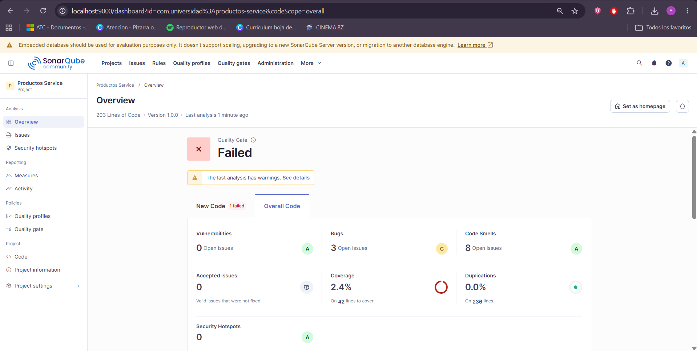
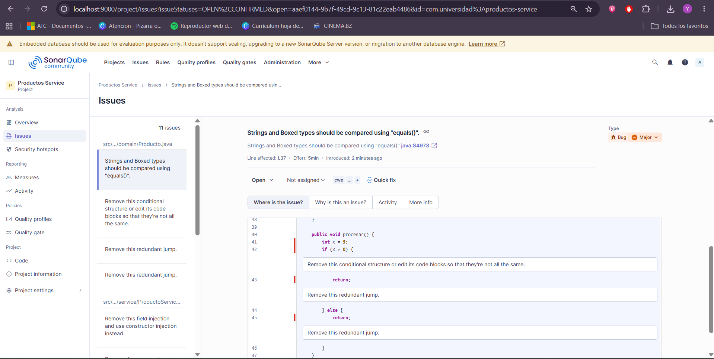
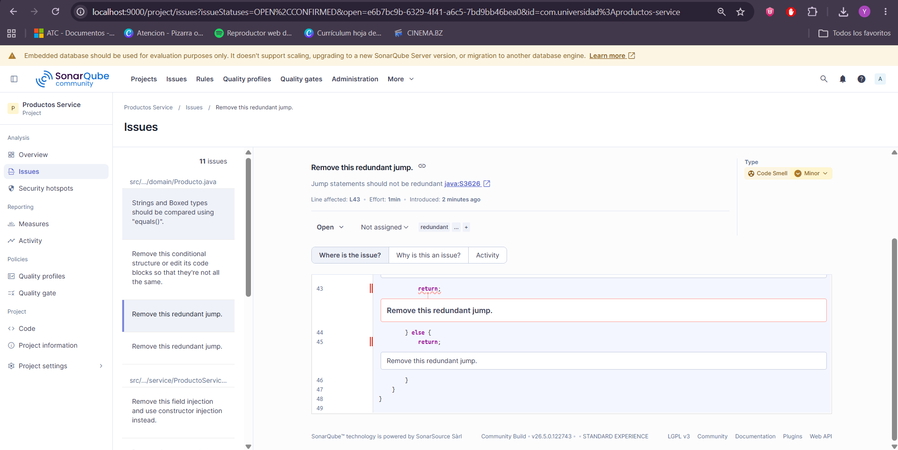
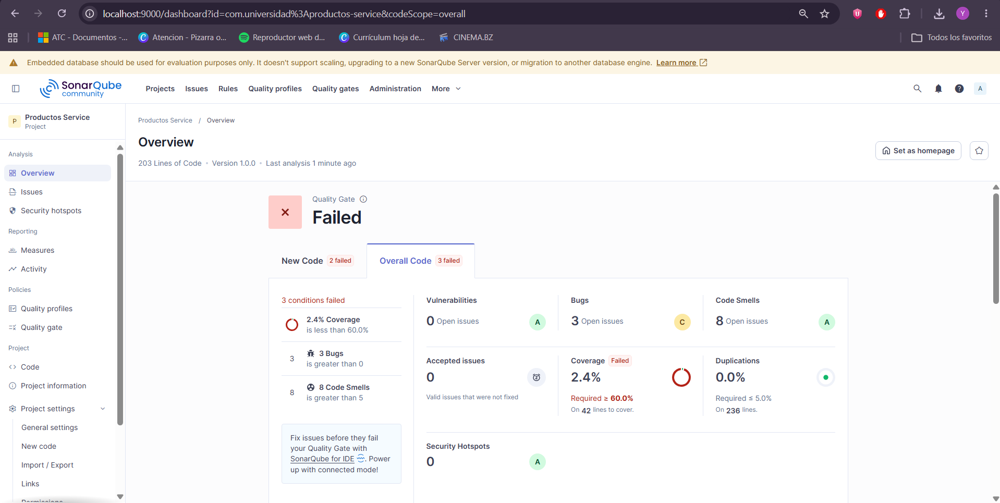
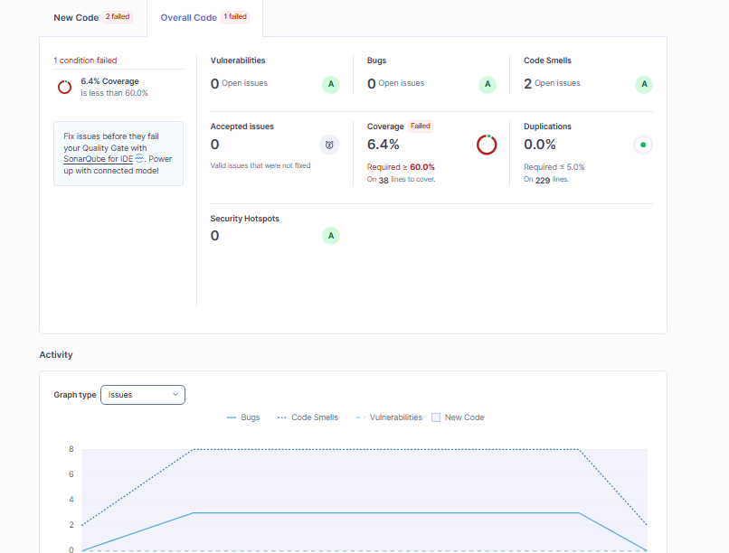

# Post-Contenido 2 — Métricas de Calidad y SonarQube

[](https://github.com/yeremy0418/silva-post2-u10/actions/workflows/ci.yml)

## Objetivo

Configurar un Quality Gate personalizado en SonarQube, corregir bugs y code smells identificados en el análisis inicial, re-ejecutar el análisis para confirmar la mejora de métricas, e integrar el análisis en el pipeline de GitHub Actions.

## Estructura del Proyecto

```
src/
├── main/java/com/universidad/productosservice/
│   ├── domain/
│   │   └── Producto.java           # Entidad JPA
│   ├── repository/
│   │   └── ProductoRepository.java # Repositorio JPA
│   ├── service/
│   │   └── ProductoService.java    # Lógica de negocio
│   └── ProductosServiceApplication.java
├── test/java/com/universidad/productosservice/
│   ├── service/
│   │   └── ProductoServiceTest.java
│   └── ProductosServiceApplicationTests.java
docs/                               # Capturas del dashboard
.github/workflows/ci.yml            # Pipeline CI
pom.xml                             # Configuración Maven + SonarQube + JaCoCo
sonar-project.properties            # Configuración SonarQube
```

## Prerrequisitos

- JDK 21, Maven 3.9+, Docker Desktop en ejecución
- SonarQube corriendo en `http://localhost:9000`
- Cuenta en [SonarCloud](https://sonarcloud.io) para el pipeline CI

## Calidad de Código

### Quality Gate Personalizado: "Estándar Universidad"

| Condición | Límite | Estado |
|---|---|---|
| Bugs > 0 | 0 bugs | ✅ |
| Coverage < 60% | ≥ 60% | ❌ (6.4%) |
| Code Smells > 5 | ≤ 5 | ✅ (2) |
| Duplicated Lines > 5% | ≤ 5% | ✅ (0%) |

### Métricas: Antes vs Después

| Métrica | Antes (Post-Contenido 1) | Después (Post-Contenido 2) | Variación |
|---|---|---|---|
| **Bugs** | 3 | **0** | ✅ Eliminados |
| **Code Smells** | 8 | **2** | ✅ -6 |
| **Coverage** | 2.4% | **6.4%** | ✅ +4% |
| **Duplicated Lines** | 0% | 0% | ✅ |
| **Líneas de código** | 195 | 195 | ✅ |
| **Violaciones totales** | 11 | **2** | ✅ -9 |

### Capturas del Dashboard

#### Dashboard General - Antes de Correcciones


#### Bug Identificado - orElse(null)


#### Code Smells Identificados


#### Quality Gate Personalizado


#### Dashboard Final - Después de Correcciones


### Correcciones Aplicadas

**Bug corregido:**
- `orElse(null)` en `buscar()` → `orElseThrow(NoSuchElementException)`
- `Optional.get()` en `buscarConGet()` → `orElseThrow(NoSuchElementException)`
- `precio == otro.precio` (Double con `==`) → `Double.compare()`
- `procesar()` con if-else duplicado → eliminado

**Code Smells corregidos:**
- `@Autowired` en campo → inyección por constructor
- `n.equals("")` → `nombre.isBlank()`
- Complejidad ciclomática: validaciones extraídas a `validarDatos()`
- Parámetros no usados (`cat`, `activo`, `proveedor`) eliminados
- `calcularStockSeguro()` → retorno directo
- `metodoConCodigoMuerto()` eliminado

## Ejecución Local

```bash
# Compilar y ejecutar pruebas
mvn clean test

# Ejecutar análisis SonarQube local
mvn clean verify sonar:sonar -Dsonar.token=TOKEN

# Ver resultado en http://localhost:9000/dashboard?id=com.universidad%3Aproductos-service
```

## Pipeline CI (GitHub Actions)

El workflow se ejecuta en cada push y pull request a la rama `main`:

1. Checkout del código con `fetch-depth: 0`
2. Configuración de Java 21 (Temurin)
3. Compilación, pruebas y análisis con SonarCloud:
   ```bash
   mvn -B clean verify sonar:sonar \
     -Dsonar.host.url=https://sonarcloud.io \
     -Dsonar.token=${{ secrets.SONAR_TOKEN }}
   ```

**Nota:** El token de SonarCloud debe configurarse como secreto del repositorio (`SONAR_TOKEN`) en Settings → Secrets and variables → Actions.

## Commits

| Commit | Descripción |
|---|---|
| `ea67510` | Configuración inicial del proyecto Spring Boot con SonarQube y JaCoCo |
| `11f412d` | Agrega entidad Producto, repositorio y servicio con bugs y code smells intencionales |
| `65544a5` | Documenta resultados del análisis inicial con tabla de métricas y capturas |
| `7406c5f` | Integra SonarQube en GitHub Actions con SonarCloud |
| *(siguiente)* | README con documentación final y tabla comparativa |
